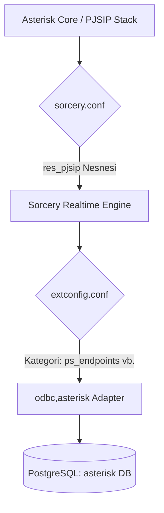

# Chapter 3: PostgreSQL Realtime Şeması ve Asterisk Eşleştirmesi

Bu bölümde, Asterisk Realtime mimarisinin veritabanı eşleştirme katmanı olan `extconfig.conf` ve `sorcery.conf` yapılandırmaları, veritabanındaki tabloların detaylı şemaları ve API'nin ihtiyaç duyduğu eksik tabloların SQL tanımları yer almaktadır.

---

## 1. Realtime Eşleştirme Katmanı (Extconfig & Sorcery)

Asterisk, hangi verilerin dinamik (veritabanından) hangi verilerin statik (dosyalardan) okunacağını iki aşamalı bir motorla belirler:



### 1.1. [extconfig.conf](file:///Users/ilkermansur/Desktop/gadget_pbx/asterisk/extconfig.conf) Yapılandırması
Bu dosya, genel Asterisk bileşenlerini ODBC motoruna bağlar:
```ini
[settings]
; PJSIP Nesneleri
ps_endpoints => odbc,asterisk
ps_auths => odbc,asterisk
ps_aors => odbc,asterisk
ps_contacts => odbc,asterisk
ps_registrations => odbc,asterisk
ps_identifies => odbc,asterisk

; Dialplan
extensions => odbc,asterisk

; Çağrı Merkezi ve Raporlama
queues => odbc,asterisk
queue_members => odbc,asterisk
queue_log => odbc,asterisk
cdr => odbc,asterisk
cel => odbc,asterisk
voicemail => odbc,asterisk
```
*   `odbc,asterisk` ifadesi; verinin **ODBC** sürücüsü kullanılarak, `res_config_odbc.conf` dosyasında tanımlanan **asterisk** veritabanı havuzundan okunacağını/yazılacağını belirtir.

### 1.2. [sorcery.conf](file:///Users/ilkermansur/Desktop/gadget_pbx/asterisk/sorcery.conf) Yapılandırması
PJSIP sürücüsü (`res_pjsip`), kendi içindeki nesne tiplerini (endpoint, auth, aor vb.) veritabanı tablolarına eşleştirmek için Sorcery veri soyutlama katmanını kullanır:
```ini
[res_pjsip]
endpoint=realtime,ps_endpoints
auth=realtime,ps_auths
aor=realtime,ps_aors
contact=realtime,ps_contacts
registration=realtime,ps_registrations
identify=realtime,ps_identifies
domain_alias=realtime,ps_domain_aliases
```
*   Bu sayede PJSIP, veritabanındaki tabloları sanki yerel bellek nesneleriymiş gibi sorgular ve yönetir.

---

## 2. Core PJSIP Tabloları

### 2.1. ps_endpoints (Dahili Profil Bilgisi)
Çağrıyı yapacak veya alacak SIP terminalinin temel parametrelerini, izin verilen kodeklerini ve çağrı davranışlarını belirler.
*   `id`: Dahili numarası (Örn: `1001`). `PRIMARY KEY`.
*   `transport`: PJSIP transport ayarı (Örn: `transport-udp`).
*   `auth`: Dahilinin şifre doğrulaması için `ps_auths` tablosundaki id ile ilişkilendirilir.
*   `aors`: Dahilinin kayıt olacağı AOR kaydını belirtir.
*   `context`: Dahilinin yapacağı çağrıların hangi dialplan bağlamına (context) gireceğini belirler (Örn: `from-internal`).
*   `allow` / `disallow`: İzin verilen kodekler.
*   **Özel Kodek Yönetim Alanları (v1.1):**
    *   `codec_ulaw`, `codec_alaw`, `codec_g729`, `codec_h264`, `codec_opus`, `codec_vp8`: Boolean alanlardır. API'den gelen seçime göre `true` / `false` set edilir.
    *   `codec_priority`: Öncelik sıralaması string olarak tutulur (Örn: `h264,ulaw,alaw`). API bu alanları birleştirerek dinamik `allow` string'ini derler.

### 2.2. ps_auths (SIP Şifre Bilgisi)
SIP cihazlarının kimlik doğrulaması için şifrelerini depolar.
*   `id`: Genelde dahili numarası ile aynı tutulur.
*   `username`: SIP Kullanıcı adı.
*   `password`: SIP Şifresi (Açık metin - Plain Text).

### 2.3. ps_aors (Address of Record - Kayıt Defteri)
SIP cihazının kaç farklı bağlantı kurabileceğini (max_contacts) ve kayıt sürelerini yönetir.
*   `id`: Dahili numarası.
*   `max_contacts`: Dahilinin aynı anda kaç farklı cihazdan (örn: IP Telefon + Softphone) register olabileceğini belirler. Default: `5`.
*   `remove_existing`: Aynı dahiliyle yeni cihaz register olduğunda eskisini ezmek için `yes` set edilir.

### 2.4. ps_contacts (Aktif Cihaz Bilgisi)
Asterisk'in cihazların anlık IP, port ve User-Agent bilgilerini tuttuğu tablodur. Bu tabloya **manuel yazım yapılmaz**, Asterisk cihazlardan REGISTER mesajı aldığında burayı kendisi günceller.
*   `uri`: Cihazın anlık IP ve portu (Örn: `sip:1001@192.168.1.50:5060`).
*   `user_agent`: Cihazın marka/model bilgisi (Örn: `Yealink SIP-T31G`). API bu alanı okuyarak telefonun fiziksel mi yoksa softphone mu olduğunu analiz eder.

---

## 3. Çağrı Akışı, Kuyruk ve Raporlama Tabloları

### 3.1. extensions (Dinamik Dialplan)
Arayüzden tanımlanan arama kurallarını barındırır.
*   `context`: Rota grubu (Örn: `from-internal`).
*   `exten`: Aranan numara veya Regex eşleşme kalıbı (Örn: `100` veya `_905XXXXXXXXX`).
*   `priority`: İşlem sırası (1, 2, 3...).
*   `app`: Çalıştırılacak Asterisk uygulaması (Örn: `Dial`, `Playback`, `Queue`, `Voicemail`).
*   `appdata`: Uygulamanın parametreleri (Örn: `PJSIP/1001`, `hello-world`, `support`).

### 3.2. queues & queue_members (Kuyruk ve Ajan Yönetimi)
Çağrı merkezleri için sıralı çağrı dağıtım kurallarını tutar.
*   `queues` tablosundaki `strategy` parametresi çağrının ajanlara nasıl dağıtılacağını belirler (`ringall` - hepsini çal, `leastrecent` - en uzun süredir boşta olana gönder vb.).
*   `queue_members` tablosu kuyruğa bağlı olan ajanları ve `penalty` (öncelik) değerlerini tutar.

### 3.3. cdr, cel & queue_log (Raporlama ve Analitik)
*   `cdr`: Çağrı bittiğinde yazılan genel özet (Arayan, Aranan, Tarih, Süre, Konuşma Süresi - Billsec, Durum - ANSWERED/NO ANSWER/BUSY).
*   `cel`: Çağrı devam ederken oluşan anlık mikro olaylar (Kanal açıldı, Aktarıldı, Beklemeye alındı, Kapandı).
*   `queue_log`: Çağrı kuyruğunda gerçekleşen detaylı olaylar (Sıraya girdi, Ajan cevapladı, Ajan reddetti, Müşteri kapattı).

---

## 4. Eksik Tabloların Şemaları (Kritik Düzeltmeler)

FastAPI API katmanında yer alan bazı router'lar (`blacklist.py`, `time_conditions.py` ve `hunt_groups.py`), `./db/init.sql` içinde tanımlanmamış tablolara erişmektedir. Sisteminizin sorunsuz çalışması için bu tabloların PostgreSQL veritabanında oluşturulması gerekir.

Aşağıdaki SQL scriptini PostgreSQL veritabanınızda çalıştırarak bu tabloları oluşturabilirsiniz:

```sql
-- ======================================================
-- 1. BLACKLIST TABLE
-- ======================================================
CREATE TABLE blacklist (
    number VARCHAR(40) PRIMARY KEY,
    note VARCHAR(255),
    created_at TIMESTAMP WITHOUT TIME ZONE DEFAULT CURRENT_TIMESTAMP
);

-- ======================================================
-- 2. TIME CONDITIONS (OFFICE HOURS) TABLE
-- ======================================================
CREATE TABLE time_conditions (
    id SERIAL PRIMARY KEY,
    name VARCHAR(80) NOT NULL,
    start_time VARCHAR(5) NOT NULL,       -- Format: '09:00'
    end_time VARCHAR(5) NOT NULL,         -- Format: '18:00'
    weekdays VARCHAR(20) NOT NULL,         -- Format: '1-5' (Mon-Fri)
    match_context VARCHAR(80) NOT NULL,    -- Mesai saatinde çağrının gideceği context
    mismatch_context VARCHAR(80) NOT NULL, -- Mesai dışı çağrının gideceği context
    created_at TIMESTAMP WITHOUT TIME ZONE DEFAULT CURRENT_TIMESTAMP
);

-- ======================================================
-- 3. HUNT GROUPS (RING GROUPS) TABLE
-- ======================================================
CREATE TABLE hunt_groups (
    id SERIAL PRIMARY KEY,
    name VARCHAR(80) UNIQUE NOT NULL,      -- Grup adı (Örn: sales_hunt)
    strategy VARCHAR(40) NOT NULL,         -- 'simultaneous' veya 'linear'
    members TEXT NOT NULL,                  -- Virgülle ayrılmış dahili listesi (Örn: '1001,1002')
    created_at TIMESTAMP WITHOUT TIME ZONE DEFAULT CURRENT_TIMESTAMP
);
```

> [!TIP]
> Bu tablolar oluşturulduktan sonra, FastAPI arayüzünden yapılan Kara Liste eklemeleri, Mesai Saatleri yönetimi ve Hunt Pilot tanımları veri kaybı olmaksızın PostgreSQL veritabanına kaydedilecek ve Asterisk dialplan switch mantığı üzerinden bu verilere erişebilecektir.
