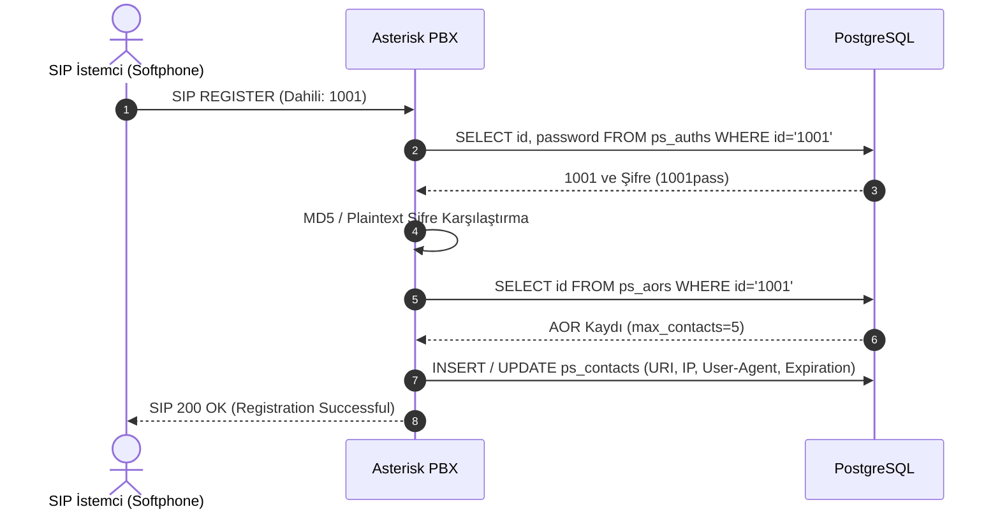
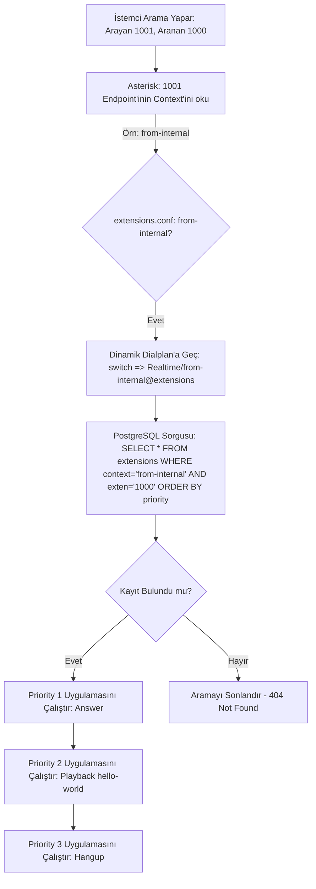

# Chapter 5: Çağrı Akışları ve Çalışma Prensipleri

Bu bölümde, projenin çalışma prensipleri; bir SIP cihazının sisteme kaydolma süreci, gelen bir çağrının dialplan tarafından işlenmesi ve çağrı sonlandığında raporlama verilerinin veritabanına yazılma süreçleri adım adım açıklanmıştır.

---

## 1. SIP Cihazı Kayıt Akışı (Registration Flow)

Bir IP Telefon veya softphone (Örn: Zoiper, MicroSIP) veritabanında tanımlı bir dahili ile sisteme bağlanmak istediğinde şu süreç gerçekleşir:

1.  **REGISTER Mesajı:** SIP İstemci, Asterisk'e bir `REGISTER` paketi gönderir.
2.  **Şifre Doğrulama:** Asterisk Sorcery katmanı, `extconfig.conf` ve `sorcery.conf` üzerindeki tanımları takip ederek `ps_auths` tablosundan ilgili dahiliye ait şifreyi sorgular.
3.  **AOR Kontrolü:** Şifre eşleşirse, eşzamanlı bağlantı limitlerini kontrol etmek için `ps_aors` tablosundan AOR profilini çeker.
4.  **Kontak Kaydı (Online Durumu):** Limitler aşılmadıysa Asterisk, cihazın anlık erişim adresi (IP:Port) ve User-Agent bilgisini `ps_contacts` tablosuna yazar. Cihaz artık arama yapmaya ve çağrı almaya hazırdır (**online**).
5.  **200 OK:** İstemciye kaydın başarılı olduğunu bildiren `SIP 200 OK` mesajı döner.

---

## 2. Arama ve Dialplan İşleme Akışı (Call Routing)

Bir dahili cihazdan numara çevrildiğinde (Arama tetiklendiğinde) Asterisk dialplan motoru devreye girer:

1.  **Context Tespiti:** Arayan dahiliye ait `ps_endpoints` tablosundaki `context` alanı okunur (Örn: `from-internal`).
2.  **Dialplan Yönlendirmesi:** Arama isteği `extensions.conf` içindeki `[from-internal]` bloğuna düşer. Bu blokta `switch => Realtime/from-internal@extensions` komutu yer alır.
3.  **Veritabanı Dialplan Sorgusu:** Asterisk, veritabanındaki `extensions` tablosunda `context = 'from-internal'` ve `exten = '1000'` olan tüm adımları filtreler ve `priority` sırasına göre sıralar.
4.  **Uygulama Çalıştırma (Execution):**
    *   **Adım 1 (Priority 1):** `Answer` (Kanalı aç / Cevapla).
    *   **Adım 2 (Priority 2):** `Playback(hello-world)` (Karşı tarafa hazır ses dosyasını çal).
    *   **Adım 3 (Priority 3):** `Hangup` (Çağrıyı sonlandır).

---

## 3. Raporlama ve Analitik Veri Akışı (Reporting Pipeline)

Bir çağrı kurulduğunda ve sonlandığında Asterisk, raporlama modüllerini kullanarak veritabanına log yazar:

### 3.1. CEL (Channel Event Logging) Akışı
Çağrı süresince gerçekleşen her mikro olay (örn: telefon çalmaya başladı, karşı taraf cevapladı, müzik dinletildi, aktarma yapıldı) anında `cel` tablosuna birer satır olay olarak eklenir. Bu veriler çağrının tüm yaşam döngüsünü (lifespan) milisaniye hassasiyetinde izlemek için kullanılır.

### 3.2. CDR (Call Detail Record) Akışı
Çağrı tamamen sonlandığında (Hangup gerçekleştiğinde) Asterisk `cdr_adaptive_odbc` modülü çağrıya ait tüm verileri toplar:
*   Arayan numara (`src`)
*   Aranan numara (`dst`)
*   Çağrının toplam süresi (`duration`)
*   Çağrının konuşma süresi (`billsec`)
*   Çağrının nasıl sonuçlandığı (`disposition`: ANSWERED, NO ANSWER, BUSY, FAILED)
*   Benzersiz çağrı kimliği (`uniqueid`)

Bu verileri tek bir özet satır halinde `cdr` tablosuna yazar. API üzerindeki `GET /reports/cdr` endpoint'i bu tabloyu sorgulayarak çağrı geçmişini raporlar.

### 3.3. Kuyruk Logları (Queue Log) Akışı
Bir çağrı, bir çağrı merkezi kuyruğuna girdiğinde (`Queue` dialplan uygulaması çalıştırıldığında) `res_odbc_queue_log` modülü tetiklenir:
*   Müşterinin kuyruğa giriş anı (`ENTERQUEUE`)
*   Kuyrukta bekleme süresi
*   Ajanın telefonu çaldığında (`RINGNOANSWER` veya `CONNECT`)
*   Çağrının sonlanma nedeni (`COMPLETEAGENT` veya `COMPLETECALLER`)

Gibi olaylar doğrudan `queue_log` tablosuna yazılır. Bu tablo, çağrı merkezinin SLA (Service Level Agreement) ve ajan performans analizlerinin temelini oluşturur.
