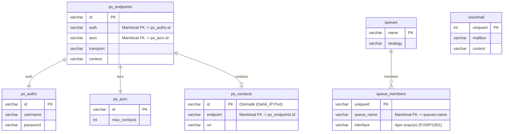

# GadgetPBX - PostgreSQL Database Schema Guide

Bu kılavuz, GadgetPBX veritabanı mimarisini (PostgreSQL 15) detaylandırmaktadır. Hangi tabloların hangi Asterisk Realtime nesnelerine karşılık geldiği, kolon veri tipleri, kısıtlamalar (constraints) ve mantıksal ilişkileri (relations) bu dokümanda açıklanmıştır.

---

## 1. İlişkisel Veri Modeli ve Bağımlılıklar

Asterisk PJSIP Realtime yapısı gevşek bağlı (loosely-coupled) bir ilişkisel model kullanır. Tablolar arasındaki anahtarlar (Keys) veri tabanı seviyesinde sert `FOREIGN KEY` kısıtlamaları yerine Asterisk Sorcery motorunun mantıksal sorguları üzerinden ilişkilendirilir. Bu tercih, Asterisk'in veritabanı okuma performansını artırmak içindir.

---

## 2. PJSIP Çekirdek Tabloları (Core SIP Stack)

### 2.1. `ps_endpoints`
Her SIP dahilisinin (cihazının) temel profil, medya, güvenlik ve codec davranışlarını tanımlayan ana tablodur.

| Kolon Adı | Veri Tipi | Varsayılan | Açıklama / Kısıtlama |
| :--- | :--- | :--- | :--- |
| `id` | VARCHAR(40) | - | **PRIMARY KEY**. Dahili ID (Örn: `"1001"`). |
| `transport` | VARCHAR(40) | - | Kullanılacak PJSIP taşıma kanalı (Örn: `"transport-udp"`). |
| `aors` | VARCHAR(200) | - | Bağlı olduğu AOR kaydı (Örn: `"1001"`). |
| `auth` | VARCHAR(40) | - | Bağlı olduğu Auth şifre kaydı (Örn: `"1001"`). |
| `context` | VARCHAR(40) | - | Çağrıların çıkacağı Dialplan context'i (Örn: `"from-internal"`). |
| `disallow` | VARCHAR(200) | `'all'` | Yasaklanan kodekler. |
| `allow` | VARCHAR(200) | `'opus,ulaw,alaw,h264,vp8'` | İzin verilen kodek string'i. |
| `direct_media` | VARCHAR(10) | `'no'` | Medyanın doğrudan cihazlar arası akmasına izin ver. |
| `rewrite_contact` | VARCHAR(10) | `'yes'` | NAT arkasındaki cihazların kontak adreslerini ez. |
| `rtp_symmetric` | VARCHAR(10) | `'yes'` | RTP trafiğini gelen IP/Porta geri gönder. |
| `force_rport` | VARCHAR(10) | `'yes'` | SIP sinyal portunu zorla (NAT çözümü). |
| `moh_suggest` | VARCHAR(40) | `'default'` | Bekleme müziği sınıfı. |
| `allow_transfer` | VARCHAR(10) | `'yes'` | Çağrı aktarma izni (`"yes"`/`"no"`). |
| `mailboxes` | VARCHAR(80) | - | Telesekreter eşleşmesi (Örn: `"1001@default"`). |
| `dnd_enabled` | BOOLEAN | `false` | Rahatsız Etmeyin durumu. |
| `codec_ulaw` | BOOLEAN | `true` | Ulaw kodek izni. |
| `codec_alaw` | BOOLEAN | `true` | Alaw kodek izni. |
| `codec_g729` | BOOLEAN | `false` | G.729 kodek izni. |
| `codec_h264` | BOOLEAN | `true` | H.264 video kodek izni. |
| `codec_opus` | BOOLEAN | `false` | Opus ses kodek izni. |
| `codec_vp8` | BOOLEAN | `false` | VP8 video kodek izni. |
| `codec_priority` | VARCHAR(255) | `'h264,ulaw,alaw'` | Kodek öncelik sıralaması. |

### 2.2. `ps_auths`
SIP doğrulaması için kimlik ve şifre bilgilerini saklar.

| Kolon Adı | Veri Tipi | Varsayılan | Açıklama / Kısıtlama |
| :--- | :--- | :--- | :--- |
| `id` | VARCHAR(40) | - | **PRIMARY KEY**. Genelde dahili numarası (Örn: `"1001"`). |
| `auth_type` | VARCHAR(10) | `'userpass'` | Kimlik doğrulama türü. |
| `username` | VARCHAR(80) | - | SIP Kullanıcı adı. |
| `password` | VARCHAR(80) | - | SIP Şifresi (Açık metin). |
| `realm` | VARCHAR(40) | - | SIP alanı/Domain adı. |

### 2.3. `ps_aors`
Kayıt limitlerini ve REGISTER parametrelerini yönetir.

| Kolon Adı | Veri Tipi | Varsayılan | Açıklama / Kısıtlama |
| :--- | :--- | :--- | :--- |
| `id` | VARCHAR(40) | - | **PRIMARY KEY**. Dahili numarası. |
| `max_contacts` | INTEGER | `5` | Aynı anda bağlanabilecek cihaz sayısı limitidir. |
| `remove_existing` | VARCHAR(10) | `'yes'` | Yeni cihaz geldiğinde eski kaydı kaldır. |
| `default_expiration` | INTEGER | - | Varsayılan REGISTER geçerlilik süresi (Saniye). |

### 2.4. `ps_contacts`
Aktif olarak register olmuş cihazların anlık IP ve User-Agent bilgileridir. **Asterisk tarafından otomatik doldurulur.**

| Kolon Adı | Veri Tipi | Açıklama / Kısıtlama |
| :--- | :--- | :--- |
| `id` | VARCHAR(255) | **PRIMARY KEY**. Kontak URI hash'i. |
| `uri` | VARCHAR(255) | Cihazın anlık IP ve Port bilgisi (Örn: `sip:1001@192.168.1.50:5060`). |
| `user_agent` | VARCHAR(255) | Telefonun marka/model bilgisi. |
| `endpoint` | VARCHAR(40) | İlişkili dahili numarası (Örn: `"1001"`). |

### 2.5. `ps_registrations`
Operatörlere/Trunk'lara yapılacak dış hat kayıt isteklerini depolar.

| Kolon Adı | Veri Tipi | Varsayılan | Açıklama |
| :--- | :--- | :--- | :--- |
| `id` | VARCHAR(40) | - | **PRIMARY KEY**. Dış hat kimliği (Örn: `"provider_trunk"`). |
| `transport` | VARCHAR(40) | - | SIP taşıma protokolü (Örn: `"transport-udp"`). |
| `server_uri` | VARCHAR(200) | - | Karşı sunucu SIP adresi (Örn: `"sip:sip.provider.com"`). |
| `client_uri` | VARCHAR(200) | - | Kayıt bilgisi (Örn: `"sip:kullanici@sip.provider.com"`). |

---

## 3. Dinamik Dialplan & Telesekreter

### 3.1. `extensions` (Dialplan Tablosu)
Asterisk'in çalışma zamanında veritabanından dinamik olarak okuduğu arama rotalarını depolar.

| Kolon Adı | Veri Tipi | Varsayılan | Açıklama / Kısıtlama |
| :--- | :--- | :--- | :--- |
| `id` | BIGSERIAL | - | **PRIMARY KEY**. Otomatik artan kayıt numarası. |
| `context` | VARCHAR(40) | - | Dialplan bağlamı (Örn: `"from-internal"`). |
| `exten` | VARCHAR(40) | - | Aranan numara veya regex şablonu (Örn: `"100"`). |
| `priority` | INTEGER | `1` | Adım sırası. |
| `app` | VARCHAR(40) | - | Çalıştırılacak uygulama adı (Örn: `"Dial"`, `"Answer"`). |
| `appdata` | VARCHAR(256) | - | Uygulamaya gönderilecek parametreler (Örn: `"PJSIP/1001"`). |

*   **Benzersizlik Kısıtlaması (Unique Constraint):** `UNIQUE (context, exten, priority)` -> Aynı context'te, aynı numaraya atanmış aynı priority adımından birden fazla olamaz.

### 3.2. `voicemail` (Telesekreter Tablosu)
Kullanıcıların sesli mesaj kutusu konfigürasyonlarını saklar.

| Kolon Adı | Veri Tipi | Varsayılan | Açıklama / Kısıtlama |
| :--- | :--- | :--- | :--- |
| `uniqueid` | SERIAL | - | **PRIMARY KEY**. Otomatik artan anahtar. |
| `mailbox` | VARCHAR(80) | - | Kutu numarası (Örn: `"1001"`). |
| `context` | VARCHAR(80) | - | Voicemail context'i (Örn: `"default"`). |
| `password` | VARCHAR(80) | - | Giriş PIN şifresi. |
| `fullname` | VARCHAR(80) | - | Kullanıcı Adı Soyadı. |
| `email` | VARCHAR(80) | - | Ses kaydı bilgilendirmesinin gönderileceği e-posta adresi. |

---

## 4. Çağrı Merkezi ve Kuyruklar (Queues)

### 4.1. `queues` (Kuyruk Tanımları)
Müşteri sıralarının (Support, Sales vb.) dağıtım ve anons stratejilerini tanımlar.

| Kolon Adı | Veri Tipi | Varsayılan | Açıklama |
| :--- | :--- | :--- | :--- |
| `name` | VARCHAR(128) | - | **PRIMARY KEY**. Kuyruk adı (Örn: `"support"`). |
| `musiconhold` | VARCHAR(128) | - | Sırada bekleyenlere dinletilecek müzik sınıfı. |
| `strategy` | VARCHAR(20) | `'ringall'` | Arama dağıtım yöntemi (Örn: `"ringall"`, `"leastrecent"`). |
| `timeout` | INTEGER | - | Ajanın telefonu kaç saniye çalacak. |
| `ringinuse` | VARCHAR(10) | `'no'` | Meşgul ajanın telefonu tekrar çalsın mı? |

### 4.2. `queue_members` (Kuyruk Ajanları)
Hangi dahili cihazın hangi kuyruğa bağlı olduğunu ve ajanın önceliğini tanımlar.

| Kolon Adı | Veri Tipi | Varsayılan | Açıklama / Kısıtlama |
| :--- | :--- | :--- | :--- |
| `uniqueid` | VARCHAR(128) | - | **PRIMARY KEY**. Tekil ID (Örn: `"support_PJSIP_1001"`). |
| `queue_name` | VARCHAR(128) | - | Ajanın bağlı olduğu kuyruk (Örn: `"support"`). |
| `interface` | VARCHAR(128) | - | Ajanın teknik arayüzü (Örn: `"PJSIP/1001"`). |
| `membername` | VARCHAR(128) | - | Ajanın insan tarafından okunabilir adı. |
| `penalty` | INTEGER | `0` | Ajanın öncelik değeri. |
| `paused` | INTEGER | `0` | Ajanın mola durumu (`1` = molada, `0` = aktif). |

---

## 5. Raporlama ve Log Tabloları (CDR & CEL)

### 5.1. `cdr` (Çağrı Detay Kayıtları)
Çağrı bittiğinde yazılan genel özet tablosudur.

| Kolon Adı | Veri Tipi | Açıklama |
| :--- | :--- | :--- |
| `src` | VARCHAR(80) | Arayan kaynak numara. |
| `dst` | VARCHAR(80) | Aranan hedef numara. |
| `dcontext` | VARCHAR(80) | Hedef dialplan bağlamı (destination context). |
| `clid` | VARCHAR(80) | Arayan CallerID bilgisi (isim + numara). |
| `channel` | VARCHAR(80) | Arayanın kanalı (Örn: `"PJSIP/1001-0000000a"`). |
| `dstchannel` | VARCHAR(80) | Arananın kanalı. |
| `start` | TIMESTAMP | Çağrının başlama zamanı. |
| `answer` | TIMESTAMP | Çağrının cevaplanma zamanı. |
| `end` | TIMESTAMP | Çağrının sonlanma zamanı. |
| `duration` | INTEGER | Toplam süre (Saniye cinsinden). |
| `billsec` | INTEGER | Konuşulan/Faturalandırılan süre (Saniye cinsinden). |
| `disposition` | VARCHAR(45) | Çağrı sonucu (`"ANSWERED"`, `"NO ANSWER"`, `"BUSY"`, `"FAILED"`). |
| `uniqueid` | VARCHAR(150) | Çağrıya ait benzersiz ID. |

### 5.2. `cel` (Kanal Olay Kayıtları)
Çağrının tüm yaşam döngüsündeki anlık olay loglarını depolar.

| Kolon Adı | Veri Tipi | Açıklama |
| :--- | :--- | :--- |
| `id` | BIGSERIAL | **PRIMARY KEY**. Otomatik artan olay numarası. |
| `eventtype` | VARCHAR(30) | Olay türü (Örn: `CHAN_START`, `ANSWER`, `TRANSFER`, `HANGUP`). |
| `eventtime` | TIMESTAMP | Olayın gerçekleştiği milisaniye düzeyinde zaman. |
| `cid_num` | VARCHAR(80) | Arayan CallerID numarası. |
| `exten` | VARCHAR(80) | Dialplan'da işlenen numara. |
| `uniqueid` | VARCHAR(150) | İlgili çağrı ID'si. |

### 5.3. `queue_log` (Kuyruk Logları)
Çağrı merkezinde kuyruklara giren müşterilerin ve ajanların tüm hareketlerini kaydeder.

| Kolon Adı | Veri Tipi | Açıklama |
| :--- | :--- | :--- |
| `id` | BIGSERIAL | **PRIMARY KEY**. Log ID. |
| `time` | TIMESTAMP | Olay zamanı. |
| `callid` | VARCHAR(80) | Kuyruk çağrı ID'si. |
| `queuename` | VARCHAR(128) | Kuyruk adı. |
| `agent` | VARCHAR(80) | İlgili ajan (Arayüz adı veya dahili). |
| `event` | VARCHAR(32) | Olay türü (Örn: `ENTERQUEUE`, `CONNECT`, `ABANDON`, `COMPLETEAGENT`). |
| `data1` - `data5` | VARCHAR(128) | Olay türüne göre değişen ek veriler (örn: bekleme süresi, konuşma süresi). |

---

## 6. API Ek Tabloları (FastAPI Custom Features)

### 6.1. `blacklist` (Kara Liste)
Engellenen telefon numaralarının verilerini depolar.

| Kolon Adı | Veri Tipi | Varsayılan | Açıklama / Kısıtlama |
| :--- | :--- | :--- | :--- |
| `number` | VARCHAR(40) | - | **PRIMARY KEY**. Engellenen telefon numarası. |
| `note` | VARCHAR(255) | - | Engelleme nedeni/Açıklama. |
| `created_at` | TIMESTAMP | `CURRENT_TIMESTAMP` | Ekleme tarihi. |

### 6.2. `time_conditions` (Zaman Koşulları / Mesai Saatleri)
Mesai saati kural tanımlarını saklar.

| Kolon Adı | Veri Tipi | Varsayılan | Açıklama / Kısıtlama |
| :--- | :--- | :--- | :--- |
| `id` | SERIAL | - | **PRIMARY KEY**. Otomatik artan kural numarası. |
| `name` | VARCHAR(80) | - | Kural adı (Örn: `"Office Hours"`). |
| `start_time` | VARCHAR(5) | - | Başlangıç saati (Örn: `"09:00"`). |
| `end_time` | VARCHAR(5) | - | Bitiş saati (Örn: `"18:00"`). |
| `weekdays` | VARCHAR(20) | - | Haftanın günleri aralığı (Örn: `"1-5"` -> Pazartesi-Cuma). |
| `match_context` | VARCHAR(80) | - | Koşul uyduğunda yönlendirilecek dialplan bağlamı. |
| `mismatch_context` | VARCHAR(80) | - | Koşul uymadığında yönlendirilecek dialplan bağlamı. |

### 6.3. `hunt_groups` (Hunt Grupları / Ring Grupları)
Ring gruplarının stratejilerini ve üyelerini depolar.

| Kolon Adı | Veri Tipi | Varsayılan | Açıklama / Kısıtlama |
| :--- | :--- | :--- | :--- |
| `id` | SERIAL | - | **PRIMARY KEY**. Otomatik artan grup numarası. |
| `name` | VARCHAR(80) | - | **UNIQUE**. Grup adı (Örn: `"sales_ring_group"`). |
| `strategy` | VARCHAR(40) | - | Çalma yöntemi (`"simultaneous"` veya `"linear"`). |
| `members` | TEXT | - | Virgülle ayrılmış dahili numaraları (Örn: `"1001,1002"`). |
